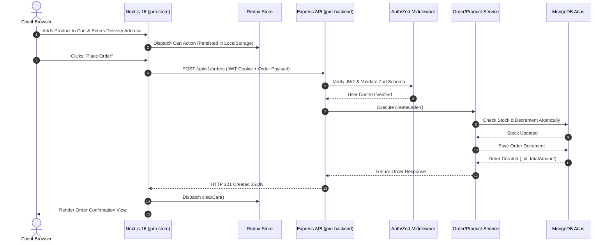

# JPM Store — Full-Stack Production E-Commerce System

> **Enterprise E-Commerce System engineered with Next.js 16, React 19, Node.js, Express.js, and MongoDB.**  
> Built strictly adhering to **SOLID Principles**, **Clean Layered Architecture**, **OWASP Security Hardening**, and **Atomic Inventory Controls**.

---

## Executive System Overview

Most portfolio e-commerce applications rely on basic CRUD operations, monolithic tight coupling, insecure local storage tokens, hardcoded fallbacks, and zero data integrity controls. 

**JPM Store** was engineered from the ground up to showcase **Senior-Level Software Engineering Standards** required in modern high-throughput enterprise environments.

---

## Master Table of Contents

- [Engineering Problems Solved](#engineering-problems-solved)
- [Threat Model & Security Mitigation Matrix](#threat-model--security-mitigation-matrix)
- [Architectural Approach & Design Patterns](#architectural-approach--design-patterns)
- [System Architecture & Sequence Diagram](#system-architecture--sequence-diagram)
- [Technology Stack Matrix](#technology-stack-matrix)
- [Repository Layout](#repository-layout)
- [Quick Start Guide](#quick-start-guide)
- [License](#license)

---

## Engineering Problems Solved

| Problem / Bottleneck in Standard Apps | How JPM Store Solves It Architecture-Wise |
|---|---|
| **Inventory Race Conditions** | Solved using atomic Mongoose conditional updates (`stock -= quantity`) during checkout, preventing stock overselling. |
| **Token Theft & XSS Attacks** | Solved by storing short-lived JWT Access Tokens in `HttpOnly`, `SameSite=Strict`, `Secure` cookies inaccessible to client scripts. |
| **NoSQL Query Injection** | Solved using `express-mongo-sanitize` middleware to strip operator characters (`$`, `.`) from request payloads. |
| **Brute-Force & DDoS Vulnerabilities** | Solved with configurable `express-rate-limit` targeting authentication and public API routes. |
| **Untamed Payload Corruption** | Solved with `Zod` schema validation at the HTTP transport boundary before requests reach domain logic. |
| **Database Setup Friction** | Solved with automated in-memory MongoDB fallback and auto-seeding if local/cloud MongoDB is unavailable. |

---

## Threat Model & Security Mitigation Matrix

| Security Threat Vector | Potential Business Impact | Technical Mitigation Strategy |
|---|---|---|
| **Cross-Site Scripting (XSS)** | Theft of session credentials and personal user data. | Storing JWTs in `HttpOnly` cookies, encoding outputs, and configuring Helmet Content Security Policies. |
| **NoSQL Injection** | Unauthorized database read/write bypass via payload operators. | Enforcing `express-mongo-sanitize` on all incoming request bodies, params, and queries. |
| **Distributed Denial of Service (DDoS)** | Server exhaustion and service downtime. | Applying rate limiting (20 auth attempts/hr, 200 API requests/15 mins per IP). |
| **Data Payload Tampering** | Insertion of unexpected fields or invalid types into database. | Validating request structures at transport entry with Zod schemas. |
| **Overselling / Stock Corruption** | Fulfilling orders without sufficient physical stock. | Atomic database conditional increments (`$inc: { stock: -qty }`). |

---

## Architectural Approach & Design Principles

### 1. Clean Layered Architecture
The backend is structured into distinct, unidirectionally dependent layers to enforce maintainability and testability:

```text
[ Client Request ] ──► [ Security Middlewares & Zod Validation ]
                                    │
                                    ▼
                           [ Controllers ]         ── HTTP Transport & Serialization
                                    │
                                    ▼
                            [ Service Layer ]      ── Pure Business & Transactional Logic
                                    │
                                    ▼
                     [ Repositories / Mongoose ]   ── Data Access & Query Execution
                                    │
                                    ▼
                         [ MongoDB Database ]      ── Persistence Store
```

### 2. SOLID Principles Enforcement
1. **Single Responsibility Principle (SRP)**: Controllers manage HTTP transport; Services execute pure business rules; Repositories execute database queries; Middlewares handle security and validation.
2. **Open/Closed Principle (OCP)**: Modular API route mounting allows adding new feature domains (e.g. reviews, coupons) without mutating existing business services.
3. **Dependency Inversion Principle (DIP)**: High-level controllers depend on abstract service boundaries rather than direct database queries.

---

## System Architecture & Sequence Diagram



---

## Technology Stack Matrix

### Frontend (`jpm-store/`)
- **Framework**: Next.js 16 (App Router), React 19
- **State Management**: Redux Toolkit (`@reduxjs/toolkit`, `react-redux`) with LocalStorage middleware
- **Styling**: Vanilla CSS Modules (`.module.css`), Google Inter Font, `react-icons`
- **API Integration**: Custom resilient API client ([`utils/api.js`](file:///c:/Users/user/Music/Projects/jpm/jpm-store/utils/api.js))

### Backend (`jpm-backend/`)
- **Runtime & Server**: Node.js, Express.js
- **Database & ORM**: MongoDB, Mongoose
- **Security & Middlewares**: `jsonwebtoken`, `bcryptjs`, `helmet`, `express-rate-limit`, `express-mongo-sanitize`, `zod`, `cookie-parser`, `cors`
- **Logging & Diagnostics**: `winston` structured logger, `morgan` HTTP access logger

---

## Repository Layout

```text
jpm/
├── jpm-store/                   # Next.js 16 Frontend Application
│   ├── app/                     # App Router pages (Home, Category, Product, Cart, Checkout, Auth)
│   ├── components/              # 23+ UI components & animations
│   ├── store/                   # Redux Toolkit state slices (Cart, Wishlist, Auth)
│   └── utils/api.js             # API client connecting to backend
│
└── jpm-backend/                 # Node.js + Express + MongoDB REST API
    ├── src/
    │   ├── config/              # Zod env validation & Mongoose DB connector
    │   ├── controllers/         # HTTP request handlers
    │   ├── services/            # Pure business & domain logic
    │   ├── models/              # Mongoose schemas with indexes & virtuals
    │   ├── middlewares/         # Security, Auth, Rate limit & Error handling
    │   ├── routes/              # Express REST endpoints
    │   └── seed/seeder.js       # Database seeder script
    ├── package.json
    └── README.md
```

---

## Quick Start Guide

### Step 1: Launch Backend Server
```bash
cd jpm-backend
npm install
npm run seed       # Seed catalog data & demo accounts
npm start          # Runs backend at http://localhost:5000
```

### Step 2: Launch Next.js Frontend
```bash
# In a new terminal window
cd jpm-store
npm install
npm run dev        # Runs frontend at http://localhost:3000
```

Open **`http://localhost:3000`** in your browser.

---

## Demo Credentials

| Role | Email | Password | Access Rights |
|---|---|---|---|
| **Admin** | `admin@jpmstore.com` | `Password123!` | Full Product CRUD & Management |
| **User** | `john@example.com` | `Password123!` | Standard Shopping, Wishlist & Checkout |

---

## License

This software is distributed under the **MIT License**.
